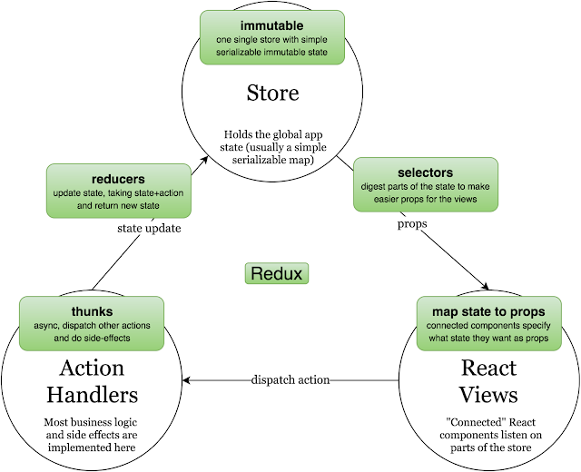

# Creating React app from scratch using CLI (command line interface)

- [Creating React app from scratch using CLI (command line interface)](#creating-react-app-from-scratch-using-cli-command-line-interface)
  - [Prerequisites](#prerequisites)
  - [Initialise react app](#initialise-react-app)
  - [HelloWorld component](#helloworld-component)
  - [TypeScript](#typescript)
  - [Material UI and Icons](#material-ui-and-icons)
  - [Storybook with TypeScript](#storybook-with-typescript)
    - [Storybook/knobs](#storybookknobs)
    - [Storybook/state](#storybookstate)
  - [Classnames](#classnames)
  - [Redux](#redux)
    - [redux-logger](#redux-logger)
    - [immutability-helper](#immutability-helper)
  - [React component lifecycle](#react-component-lifecycle)
  - [Client-Server support](#client-server-support)
    - [Backend](#backend)
    - [Frontend](#frontend)

## Prerequisites

- [Visual Studio Code](https://code.visualstudio.com/)
  - Extensions: 
    - Prettier   (to enable formattign: `File` => `Preferences` =>  `Settings`, check `Format On Save`)
    - TSLint
- [Node.js](https://nodejs.org/en/)
- [Yarn](https://yarnpkg.com/lang/en/)

## Initialise react app

Open Visual Studio Code, navigate to folder where you'd like to create your application. Press `ctrl + ~` to open terminal (powershell) and inter those commands:

```javascript
yarn global add create-react-app        // installs create-react-app script **globally** on machine
mkdir client                            // create-react-app will fail if folder doesn't start with lowercase
create-react-app client
cd client
yarn                                    // download all dependencies into node_modules
yarn start                              // starts development server (watch)
yarn test                               // runs tests (watch)
```

## HelloWorld component

Create file `helloworld.jsx` in `client\components` folder. Inside create a simple react component that can be later mounted in App:

```typescript
class HelloWorld extends React.Component {
    render() {
        return <h1>Hello, {this.props.name}</h1>;
    }
}
```

Add proper import to App.js and include new component in it's render method:

```typescript
import HelloWorld from './components/helloworld'
```

____

## TypeScript

Detailed instruction can be found [on create-react-app website](https://create-react-app.dev/docs/adding-typescript/)

```javascript
yarn global add tslint typescript
yarn add typescript @types/node @types/react @types/react-dom @types/jest
```

- rename `App.js` => `App.tsx` (`.ts` won't work, since App uses JSX syntax)
- modify existing HelloWorld component to use TypeScript:

    ```typescript
    import React from 'react';
    import { createStyles, WithStyles, withStyles, Theme } from '@material-ui/core/styles';

    const styles = (theme: Theme) =>
        createStyles({
            wrapper: {
                backgroundColor: theme.palette.primary.main,
            },
        });

    interface HelloWorldProps {
        name: string;
    }

    class HelloWorld extends React.Component<HelloWorldProps & WithStyles<typeof styles, true>> {
        render() {
            return <h1 className={this.props.classes.wrapper}>Hello, {this.props.name}</h1>;
        }
    }

    export default withStyles(styles, { withTheme: true })(HelloWorld);
    ```

- restart development server  (yarn start)

____

## Material UI and Icons

We will be adding [material ui](https://material-ui.com/) since it's good support.

```javascript
yarn add @material-ui/core @material-ui/icons
```

____

## Storybook with TypeScript

Detailed instructions can be found [on storybook website](https://storybook.js.org/docs/guides/guide-react/)

```javascript
npx -p @storybook/cli sb init --type react
```

[Typescript configuration](https://storybook.js.org/docs/configurations/typescript-config/)

```javascript
yarn add -D typescript awesome-typescript-loader @storybook/addon-info react-docgen-typescript-loader jest "@types/jest" ts-jest
```

- create `client/.storybook/webpack.config.js` with this contents:

    ```typescript
    module.exports = ({ config }) => {
        config.module.rules.push({
            test: /\.(ts|tsx)$/,
            use: [
                {
                    loader: require.resolve('awesome-typescript-loader'),
                },
                // Optional
                {
                    loader: require.resolve('react-docgen-typescript-loader'),
                },
            ],
        });
        config.resolve.extensions.push('.ts', '.tsx');
        return config;
    };
    ```

- modify `client/.storybook/config.js`  change line 4 to:

    ```typescript
    configure(require.context('../stories', true, /\.stories\.tsx$/), module);
    ```

- ceate new story with `.tsx` extension

    ```typescript
    import React from 'react';
    import { storiesOf } from '@storybook/react';
    import Card from '../src/components/card';

    storiesOf('Cards', module).add('Single card', () => (
        <Card Value={3} IsSelected={false} onSelection={val => {}} />
    ));
    ```

### Storybook/knobs

Add support for [Knobs](https://github.com/storybookjs/storybook/tree/master/addons/knobs)

```javascript
yarn add @storybook/addon-knobs --dev
```

- Add `import '@storybook/addon-knobs/register';` to `client/.storybook/addons.js`

Adding knobs to the story, require adding a decorator and import:

```typescript
/* ... */
import { text, withKnobs, boolean, number } from '@storybook/addon-knobs';

storiesOf('Cards', module)
    .addDecorator(withKnobs)            // add decorator here
    .add('Single card', () => <Card Title={text('Title', 'Test title')} />);
```

### Storybook/state

To add support for [Storybook/State](https://github.com/dump247/storybook-state)

```javascript
yarn add @dump247/storybook-state --dev
```

Modify a story to add state object

```typescript
storiesOf('Cards', module)
    .addDecorator(withKnobs)
    .add(
        'Card with knobs and store',
        withState({ IsSelected: false })(({ store }) => (
            <Card
                Value={number('Value', 3)}
                IsSelected={store.state.IsSelected}
                onClick={() => {
                    store.set({ IsSelected: !store.state.IsSelected });
                    action('clicked');
                }}
            />
        ))
    )
```

____

## Classnames

You can use [Classnames](https://www.npmjs.com/package/classnames) for Easier management of conditional classes in JSX components

```javascript
yarn add classnames @types/classnames
```

If you want to switch classes from `normal` to `selected` but always keep `card` class on target object, this will be proper syntax using `classnames`:

```typescript
var wrapperClasses = classNames({
    [classes.card]: true,
    [classes.selected]: this.props.IsSelected,
    [classes.normal]: !this.props.IsSelected,
});
```

____

## Redux



- https://stackoverflow.com/questions/53111195/typescript-with-classnames-no-index-signature
- https://redux.js.org/recipes/usage-with-typescript
- Working example: https://codesandbox.io/s/w02m7jm3q7

```javascript
yarn add redux react-redux redux-actions @types/react-redux @types/redux-actions
```

### redux-logger

Redux logger outputs each action (and state) to console

```javascript
yarn add redux-logger @types/redux-logger
```

After adding package you need to configure store to use logger as middleware in `client\src\store\index.ts` file.


### immutability-helper

In order to modify state without mutating it (required for Redux state) we can use [react imutability helper](https://github.com/kolodny/immutability-helper). If they're used incorreclty they can break TypeScript!

```javascript
yarn add immutability-helper
```

https://stackoverflow.com/questions/35628774/how-to-update-single-value-inside-specific-array-item-in-redux

- Create store schema/structure in `client\src\store\model\index.ts`

    ````typescript
    export type Id = string;

    export interface StoryState {
        Title: string;
        IsVoteRevealed: boolean;
    }

    export interface UserData {
        id: Id;
        name: string;
        vote: number | null;
    }

    export interface UserState {
        currentUserId: Id;
        users: Array<UserData>;
    }

    export interface StoreState {
        story: StoryState;
        users: UserState;
    }
    ````

- Create actions in `client\src\store\actions\types.ts`
  - UserCreate
  - UserDelete
  - UserRename
  - UserVote
  - StoryReveal
  - StoryReset

    ```typescript
    export const USER_VOTE = 'USER_VOTE';
    interface UserVoteAction {
        type: typeof USER_VOTE;
        id: Id;
        vote: number;
    }

    export type Actions = /* All actions that you've created */ | UserVoteAction;
    ```

- Create actionCreators in `client\src\store\actions\index.ts`

    ```typescript
    import { Actions, USER_VOTE } from './types';
    import { Id } from '../model';

    export function UserVoteRequest(id: Id, vote: number): Actions {
        return {
            type: USER_VOTE,
            id: id,
            vote: vote,
        };
    }
    ```

- Create reducers
  - StoryReducer `client\src\store\reducers\storyReducer.ts`

    ```typescript
    import { StoryState } from "../model";
    import { Actions } from "../actions/types";

    export const initialStoryState: StoryState = {
        Title: '(no title)',
        IsVoteRevealed: true
    };

    export default function storyReducer(state = initialStoryState, action: Actions): StoryState {
        switch (action.type) {
            default:
                return state;
        }
    }
    ```

  - UserReducer `client\src\store\reducers\userReducer.ts`

    ```typescript
    import { UserState, UserData } from '../model';
    import { USER_VOTE, Actions } from '../actions/types';
    import update from 'immutability-helper';

    export const initialUserState: UserState = {
        currentUserId: 'aaa',
        users: [ { id: 'aaa', name: 'Bob', vote: null } ],
    };

    export default function userReducer(state = initialUserState, action: Actions): UserState {
        switch (action.type) {
            /* ... */
            case USER_VOTE:
                if (!state.users.find(u => u.id === action.id)) {
                    return state;
                }

                let userVoteIndex = state.users.findIndex(u => u.id === action.id);
                const userWithVote: UserData = update(state.users[userVoteIndex], { vote: { $set: action.vote } });
                const updatedUsers: UserData[] = update(state.users, {
                    $splice: [[userVoteIndex, 1, userWithVote]],
                });
                return { ...state, users: updatedUsers };

            default:
                return state;
        }
    }
    ```

- Create store in `client\src\store\index.ts`

    ```typescript
    import logger from 'redux-logger';
    import userReducer, { initialUserState } from './reducers/userReducer';
    import storyReducer, { initialStoryState } from './reducers/storyReducer';
    import { createStore, combineReducers, applyMiddleware, compose } from 'redux';
    import { StoreState } from './model';

    const rootReducer = combineReducers({
        story: storyReducer,
        users: userReducer,
    });

    export type AppState = ReturnType<typeof rootReducer>;

    export const initialState: StoreState = {
        story: initialStoryState,
        users: initialUserState,
    };

    export default function CreateStore() {
        return createStore(rootReducer, initialState, compose(applyMiddleware(logger)));
    }
    ```

- Create connected component Deck in `client\src\containers\deck.tsx`

    ```typescript
    import React, { Component } from 'react';
    import { connect } from 'react-redux';
    import { StoreState, UserData } from '../store/model';
    import { UserVoteRequest } from '../store/actions';
    import Cards from '../components/cards';

    interface DeckContainerProps {
        currentUserId: string;
        currentUser: UserData | undefined;
        SelectedValue: number | null;
    }

    interface DeckContainerDispatch {
        VoteAction: typeof UserVoteRequest;
    }

    class DeckContainer extends Component<DeckContainerProps & DeckContainerDispatch> {
        onSelect = (newValue: number) => {
            this.props.VoteAction(this.props.currentUserId, newValue);
        };

        render() {
            return <Cards SelectedValue={this.props.SelectedValue} onSelect={this.onSelect}></Cards>;
        }
    }

    function mapStateToProps(state: StoreState): DeckContainerProps {
        const currentUserId = state.users.currentUserId;
        const currentUser = state.users.users.find(u => u.id === currentUserId);

        return {
            currentUserId: currentUserId,
            currentUser: currentUser,
            SelectedValue: currentUser !== undefined ? currentUser.vote : null,
        };
    }

    const mapDispatchToProps: DeckContainerDispatch = {
        VoteAction: UserVoteRequest,
    };

    export default connect(mapStateToProps, mapDispatchToProps)(DeckContainer);
    ```

- Inject store using redux Provider into App

    ```typescript
    import React from 'react';
    import { Provider } from 'react-redux';
    import CreateStore from './store';
    import Deck from './containers/deck';

    const store = CreateStore();

    export default class App extends React.Component {
        render() {
            return (
                <Provider store={store}>
                    <div className="App">
                        <Deck />
                    </div>
                </Provider>
            );
        }
    }
    ```

## React component lifecycle

Full article: https://programmingwithmosh.com/javascript/react-lifecycle-methods/

[React component lifecycle](https://i0.wp.com/programmingwithmosh.com/wp-content/uploads/2018/10/Screen-Shot-2018-10-31-at-1.44.28-PM.png?ssl=1 "React component lifecycle")

- The render() is the most used lifecycle method.
  - It is a pure function.
  - You cannot set state in render()
- The componentDidMount() happens as soon as your component is mounted.
  - You can set state here but with caution.
  - This is a good place to initiate API calls and invoke actions
- The componentDidUpdate(prevProps) happens as soon as the updating happens.
  - You can set state here but with caution.
- The componentWillUnmount() happens just before the component unmounts and is destroyed.
  - This is a good place to cleanup all the data.
  - You cannot set state here.

## Client-Server support

From front-end we will emit actions to backend, which will reflect them to each connected client, so state is consistent for everybody

### Backend

We will use express generator to create template for backend application. We will be using `npm` for this one (as `npm` is set up by default by express-generator)

```javascript
cd server
npx express-generator
npm install --save socket.io
```

We will update app.js file:

```javascript
var app = require("express")();
var server = require("http").Server(app);
var io = require("socket.io")(server);

// WARNING: app.listen(80) will NOT work here!
server.listen(80);

// Initial state (required to be sent to connecting clients for consistency)
let users = [];
let story = {
  Title: "(no title)",
  IsVoteRevealed: false
};

io.on("connection", function(socket) {
  console.log(
    "Connected: " +
      socket.client.conn.id +
      ". Sending " +
      users.length +
      " users and story"
  );

  // on connection send initial state
  socket.emit("action", { type: "USER_INIT", users: users });
  socket.emit("action", { type: "STORY_INIT", story: story });

  // on receiving action, modify current state
  socket.on("action", function(payload) {
    switch (payload.type) {
      case "USER_CREATE":
        users.push({ id: payload.id, name: payload.name, vote: null });
        break;
      case "USER_DELETED":
        let deletedIndex = users.findIndex(u => u.id === payload.id);
        users = users.splice(deletedIndex, 1);
        break;
      case "USER_VOTE":
        let voteIndex = users.findIndex(u => u.id === payload.id);
        users[voteIndex].vote = payload.vote;
        break;
      case "USER_RENAME":
        let renameIndex = users.findIndex(u => u.id === payload.id);
        users[renameIndex].name = payload.newName;
        break;
      case "STORY_RENAME":
        story.Title = payload.newTitle;
        break;
      case "STORY_REVEAL":
        story.IsVoteRevealed = true;
        break;
      case "STORY_RESET":
        story = {
          Title: "(no title)",
          IsVoteRevealed: false
        };
        break;
    }

    // deleting isRequest property from incoming action before forwarding
    delete payload.isRequest;
    console.log(payload);

    // broadcast to everyone but client
    socket.broadcast.emit("action", payload);

    // broadcast to client
    socket.emit("action", payload);
  });
});

module.exports = app;
```

### Frontend

Usually API requests require 3 actions:

- API_REQUEST - reducers might note that request has gone off (loader? disabled button)
- API_REQUEST_SUCCESS (with data) - reducers will unblock buttons/loaders and user new data
- API_REQUEST_FAILURE (with reason/excepion) - reducers will unblock buttons/loaders and notify about errors

We will not care about potential failures. All of our actions will be Requests (and will not be processed by reducers) and we will only process Responses (reflected actions) from Backend.

- Add socket.io client:

    ```javascript
    yarn add socket.io-client
    ```

- Modify all Request actions to extend also BroadcastableAction in `client\src\store\actions\types.ts`

    ```typescript
    interface BroadcastableAction {
        isRequest: true;
    }

    /* ... */

    export const USER_VOTE = 'USER_VOTE';
    interface UserVoteAction {
        type: typeof USER_VOTE;
        id: Id;
        vote: number;
    }
    interface UserVoteRequest extends UserVoteAction, BroadcastableAction {}
    interface UserVoteResponse extends UserVoteAction {}

    /* ... */

    export type Requests =
        | UserVoteRequest
        /* ... */;

    export type Responses =
        | UserVoteResponse
        /* ... */;
    ```

- Add socket.io-client middleware to store `client\src\store\index.ts`:

    ```typescript
    import socketIO from 'socket.io-client';

    /* ... */

    const io = socketIO.connect(`http://localhost:80`);

    /* ... */

    export default function CreateStore() {
        return createStore(rootReducer, initialState, compose(applyMiddleware(socketIoMiddleware(io), logger)));
    }
    ```

- Change reducers so they only accept actions of type Responses:

    ```typescript
    /* ... */

    export function storyReducer(state = initialStoryState, action: Responses): StoryState {
        /* ... */
    }
    ```
